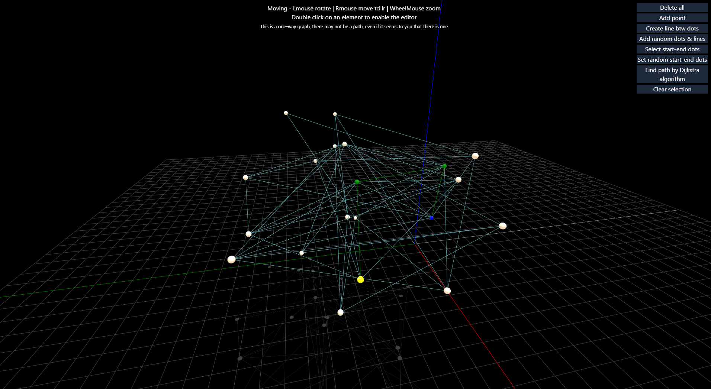

# THREE.js Typescript Preact Tailwindcss Vite Zustand ([Example](https://gonzika.github.io/threejs-vite/))

> Reading a book about algorithms inspired me to write this.

## [I tried adding some reactivity to THREE.js elements since managing state was proving to be a real pain.](src/forms/ReactiveMesh.ts)
